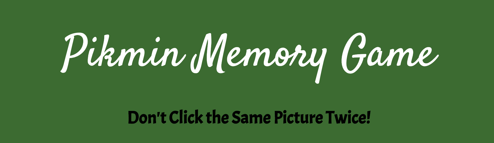
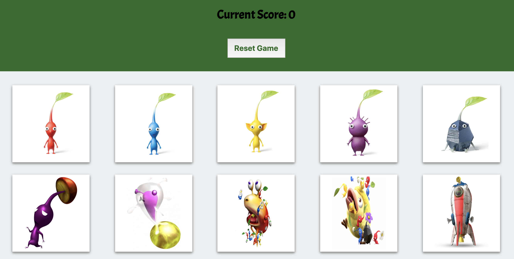
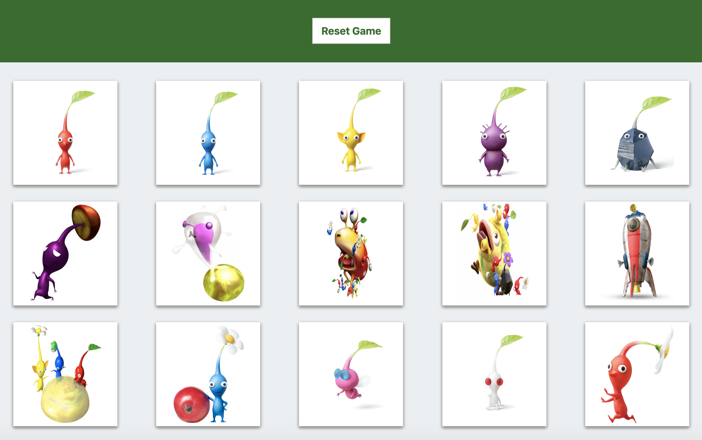

#  Pikmin Memory Game 
### (Clicky Game)
 _Full Stack Application_

#### Deployed Link:
* https://pikmin-clicky.herokuapp.com/

### About

Demonstrates full stack application using React to render and re-render images on page. 

***

***

***

### Technologies Used

* React

* Node JS

* Bootstrap

* Javascript

* Express

* JSON

